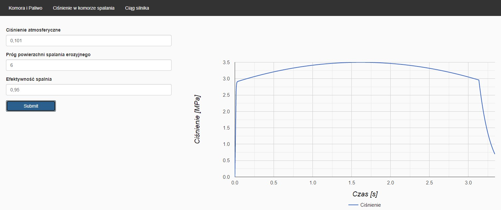
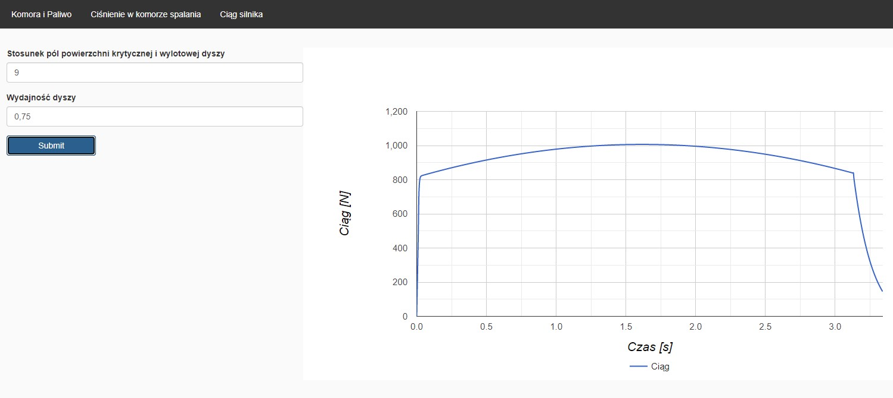

# rocketryapp

REST API wykorzystywane do dostarczania danych dla interfejsu użytkownika. Aplikacjas wspomaga konstrukcje silnika 
rakietowego na paliwa stałe, która w łatwy sposób umożliwi użytkownikowi przewidywać 
osiągi takiego napędu, na podstawie rozmiaru komory silnika, paliwa oraz jego rodzaju i 
zacisku krytycznego dyszy.

## Instalacja
Po rozpakowaniu projektu w katalgu głownym otwórz konsole poleceń i wpisz polecenie `mvn clean verify`.
Po pomyślnym zbudowaniu aplikacji wywołaj polecenie `java - jar target/rocketryapp-0.0.1-SNAPSHOT.jar`

## Zdjęcia 

