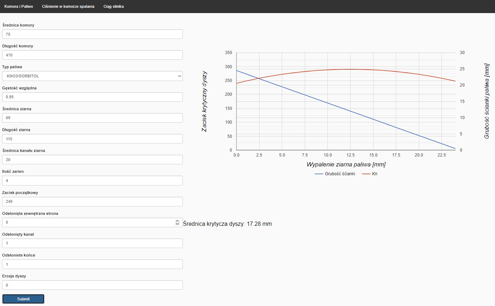

# rocketryapp

REST API wykorzystywane do dostarczania danych dla interfejsu użytkownika. Aplikacjas wspomaga konstrukcje silnika 
rakietowego na paliwa stałe, która w łatwy sposób umożliwi użytkownikowi przewidywać 
osiągi takiego napędu, na podstawie rozmiaru komory silnika, paliwa oraz jego rodzaju i 
zacisku krytycznego dyszy.

## Instalacja
Projekt można zaimportować z gituhba do IDE, skompilować i utworzyć jara.

## Zdjęcia 

